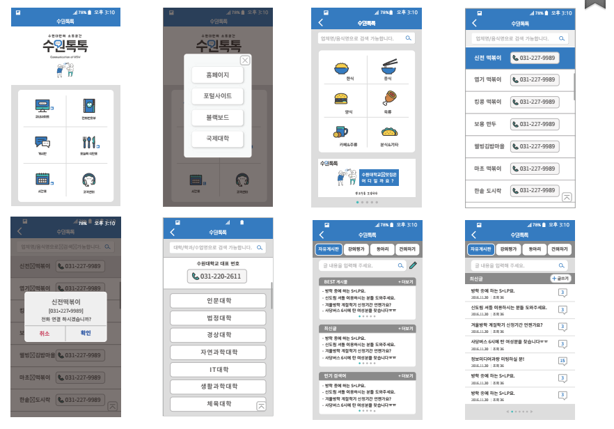

# Community Application

## Introduction
> This is an Hybrid application based on responsible website.
- The target of this is Suwon University students.
- For the most part of Univ's students use Facebook as a community space of them.
- However, there are some critical inconveniences on them.
- So, This app will solve the problems and attract users of the communities to this community.

## What's inside?
- 4 Bulletin boards to write anonymously.
- Telephone books about inside of University and shops, restaurants around the university.
- Collections of University Websites.
- Time tables of public transportation and school bus.
- Daily menu of the university.

## Screen Shot

## Market links
-Android :
 https://play.google.com/store/apps/details?id=com.jointree.suwontalktalk

-IOS : 
 https://appsto.re/kr/e8xmeb.i
